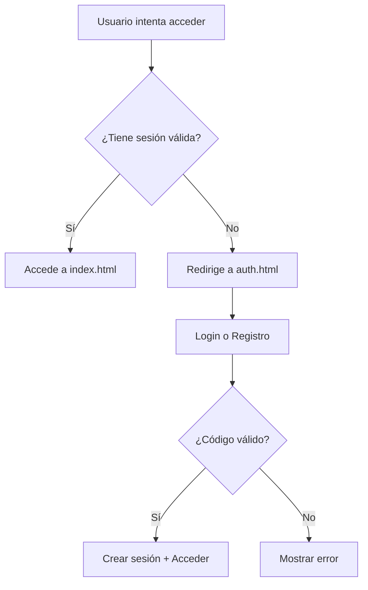

# 🔐 Sistema de Autenticación TodoBalon

## 🚀 Implementación Completa

Tu página ahora tiene un **sistema de autenticación completo** con:

### ✨ **Características:**
- 🔒 **Login con código de acceso** único por usuario
- 📝 **Registro** con código de autorización del admin
- 👤 **Panel de administrador** para generar códigos
- 🔄 **Sesiones persistentes** (24 horas)
- 📱 **Responsive** y diseño mode oscuro
- 🛡️ **Seguridad** con Netlify Functions (serverless)

---

## 📁 **Archivos Nuevos:**

```
tu-proyecto/
├── auth.html          # Página de login/registro
├── auth.js            # Lógica de autenticación
├── netlify.toml       # Configuración de Netlify
└── netlify/functions/ # Backend serverless
    ├── auth-login.js      # Validar login
    ├── auth-register.js   # Registrar usuarios
    └── auth-generate.js   # Generar códigos (admin)
```

---

## 🔧 **Configuración en Netlify:**

### 1. **Variables de Entorno** (Site Settings > Environment Variables):

```bash
# Contraseña para generar códigos
ADMIN_PASSWORD=tu_password_super_secreto_aqui

# Códigos válidos para registro (separados por coma)
VALID_AUTH_CODES=TB123456,TB789012,TB345678,TBABCDEF

# Usuarios registrados (formato JSON)
REGISTERED_USERS={"ABC12345":{"name":"Usuario Demo","email":"demo@email.com","active":true,"registeredAt":"2025-01-01T00:00:00.000Z"}}
```

### 2. **Deploy Settings:**
- Build command: (dejar vacío)
- Publish directory: `.` (punto)
- Functions directory: `netlify/functions`

---

## 👨‍💼 **Uso como Admin:**

### **Generar Códigos de Autorización:**
1. Ve a `tu-sitio.netlify.app/auth.html`
2. Click en **"Panel Admin"**
3. Ingresa tu contraseña admin
4. Se genera un código como `TB123456`
5. Comparte este código con usuarios autorizados

### **Ver Usuarios Registrados:**
- Los usuarios se almacenan en la variable `REGISTERED_USERS`
- Puedes ver los logs en Netlify Functions

---

## 👥 **Uso para Usuarios:**

### **Registro (Primera vez):**
1. Ve a `auth.html`
2. Click en **"Registrarse"**
3. Ingresa:
   - Nombre de usuario
   - Email (opcional)
   - Código de autorización (proporcionado por admin)
4. Recibe código de acceso único
5. Ya puede hacer login

### **Login:**
1. Ve a `auth.html` 
2. Ingresa su código de acceso
3. Acceso automático a `index.html`
4. Sesión válida por 24 horas

---

## 🔒 **Flujo de Seguridad:**



---

## 🛠️ **Próximos Pasos Recomendados:**

### **Para Base de Datos Real:**
1. **Supabase** (más fácil):
   ```javascript
   // En auth-register.js
   const supabase = createClient(url, key)
   await supabase.from('users').insert(userData)
   ```

2. **Airtable** (sin código):
   ```javascript
   // API de Airtable para almacenar usuarios
   ```

3. **MongoDB Atlas** (más completo):
   ```javascript
   // Conectar con MongoDB
   ```

### **Mejoras Adicionales:**
- [ ] Renovación automática de códigos
- [ ] Dashboard de administrador web
- [ ] Logs de acceso
- [ ] Límites de intentos de login
- [ ] Notificaciones por email
- [ ] Códigos temporales con expiración

---

## 🚀 **Deploy a Netlify:**

1. **Sube tu proyecto** a GitHub
2. **Conecta con Netlify**
3. **Configura variables de entorno**
4. **Deploy automático**
5. **Tu sitio estará protegido** en `tu-sitio.netlify.app`

---

## 🔐 **Ejemplo de Uso:**

1. **Admin genera código:** `TB123456`
2. **Usuario se registra** con `TB123456`
3. **Sistema genera código de acceso:** `XY789ABC`  
4. **Usuario hace login** con `XY789ABC`
5. **Accede a los canales** por 24 horas

---

## 💡 **Ventajas de esta Implementación:**

✅ **Sin costo extra** (Netlify Functions gratis hasta 125k requests)  
✅ **Escalable** (fácil migrar a base de datos)  
✅ **Seguro** (códigos únicos, sesiones temporales)  
✅ **Fácil de usar** (UI intuitiva)  
✅ **Mantenible** (código limpio y documentado)  

¡Tu sistema de autenticación está listo! 🎉
